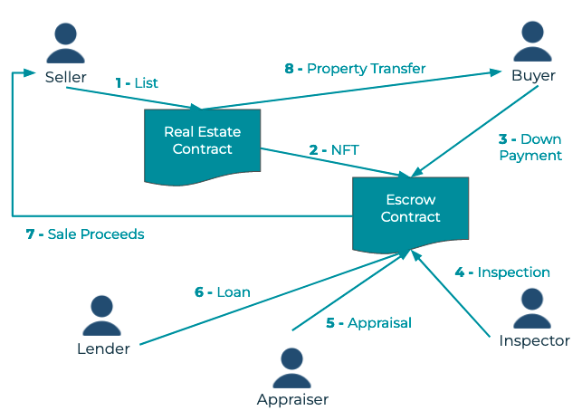

# Real Estate DApp

## About

This decentralized app allows real estate transactions to take place in the Blockchain and covers the main aspects of real estate workflow.

A seller can list their property on the Blockchain as a tokenized NFT. Buyers can select it to buy. The inspector can conduct an inspection and if it passes, they approve it. The lender can then approve and transfer the funds to the seller, and the property token can be approved to transfer its ownership to the buyer.

The real estate properties metadata are stored on the IPFS.

To fully test the DApp, launch the Hardhat node and run the deploy script as desscribed below.


## Main Components of the Workflow Diagram

<p align="center"></p>

## Requirements and Setup

### Required Technologies and Libraries

```
Node v16.20.2
React.js 18.2.0
Hardhat (includes ethers)
Solidity 0.8.0
IPFS
Metamask
```

### Deployment Instructions

- Install all requisite npm packages:

```
npm install
```

- Launch Hardhat:

```
npx hardhat node
```

- Test the smart contracts:

```
npx hardhat test
```

- In a separate terminal execute this to deploy the contracts:

```
npx hardhat run ./scripts/deploy.js --network localhost
```

- In a separate terminal window, launch the DApp's front end:

```
npm run start
```

- To use the dapp:

```
http://localhost:3000
```

#### Additional Setup

Please set up your metamask test accounts to match Hardhat addresses:

1. Account[0] => Assigned to the Buyer
2. Account[1] => Assigned to the Seller
3. Account[2] => Assigned to the Inspector
4. Account[3] => Assigned to the Lender
